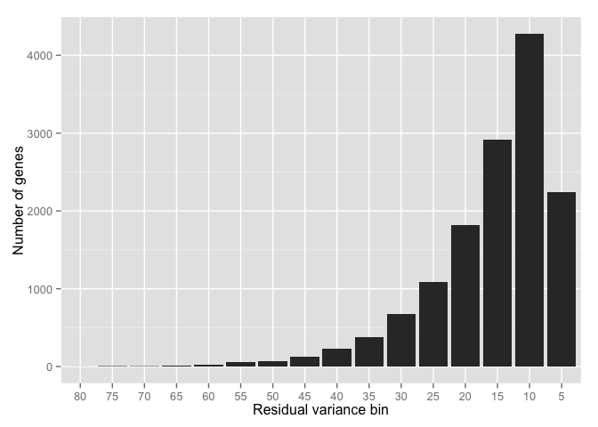
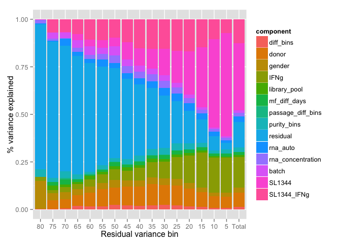
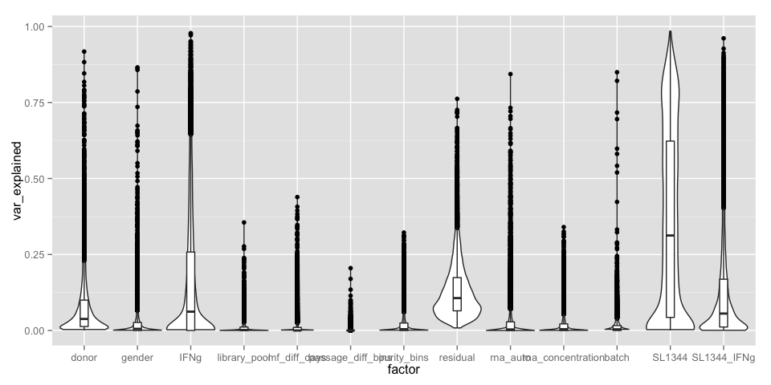
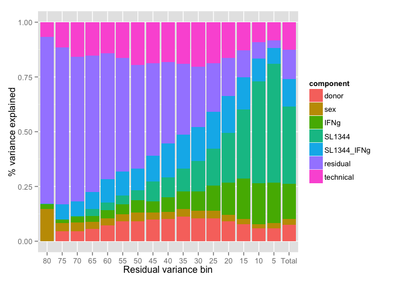

# Variance Component analysis of Salmonella RNA-Seq data


```
## Loading seqUtils
## Creating a generic function for 'nchar' from package 'base' in package 'S4Vectors'
```
The varianceComponents.R script generated two tables that contain the variance explaind by each factor for each gene. Let's look at the extended model first that includes many potential factors.

First, lets import the variance compoment estimates for each gene:

```r
model_extended = readRDS("results/SL1344/varComp/model_extended_results.rds") %>% tbl_df() %>%
  dplyr::filter(converged == TRUE) %>% #Remove genes where lmr4 did not converge
  dplyr::select(-type, -converged) %>% #Remove unnecessary columns
  dplyr::rename(residual = Residual,SL1344_IFNg = `SL1344:IFNg`, batch = salmonella) #Rename some factos
```

Now, we first bin the genes by the amount of residual variance. We notice that only a small number of genes have high residual variance. 

```r
binned_table = binGenesByResidual(model_extended, n_bins = 20)
bin_size_table = dplyr::group_by(binned_table, residual_bin) %>% dplyr::summarise(bin_size = length(residual_bin))
bin_sizes_plot = ggplot(bin_size_table, aes(x = residual_bin, y = bin_size)) + geom_bar(stat = "identity") + 
  ylab("Number of genes") + 
  xlab("Residual variance bin")
bin_sizes_plot
```

 

```r
ggsave("results/SL1344/varComp/variance_bins_hist.pdf", bin_sizes_plot, width = 6, height = 2)
```

We can now look what are the factors that explain variance in each bin. 


```r
var_explained = meanVarianceWithinBins(binned_table)
plotBinnedVariance(var_explained)
```

 

However, this plot becomes hard to read, becuase there are so many different factors. Let's focus on the total variance explaind by each component. Here is the mean variance explained by each factor:


```r
total_var = dplyr::filter(var_explained, residual_bin == "Total") %>% 
  arrange(-var_explained)
total_var
```

```
## Source: local data frame [14 x 3]
## Groups: residual_bin [1]
## 
##    residual_bin         component var_explained
##          (fctr)            (fctr)         (dbl)
## 1         Total            SL1344   0.352068314
## 2         Total              IFNg   0.162204983
## 3         Total          residual   0.132716589
## 4         Total       SL1344_IFNg   0.126186654
## 5         Total             donor   0.076187766
## 6         Total          rna_auto   0.028771723
## 7         Total            gender   0.024770485
## 8         Total       purity_bins   0.023673319
## 9         Total rna_concentration   0.019991547
## 10        Total      mf_diff_days   0.015256509
## 11        Total             batch   0.013862272
## 12        Total         diff_bins   0.013196706
## 13        Total      library_pool   0.009713141
## 14        Total passage_diff_bins   0.001399990
```

```r
write.table(total_var, "results/SL1344/varComp/total_variance_explained.txt", quote = FALSE, row.names = FALSE, sep = "\t")
```

We can also look at the distribution of variance explained across genes:


```r
dat = tidyr::gather(model_extended, factor, var_explained, donor:SL1344_IFNg)
variance_dist_plot = ggplot(dat, aes(x = factor, y = var_explained)) + geom_violin(scale = "width" ) + geom_boxplot(width = .2)
variance_dist_plot
```

 

```r
ggsave("results/SL1344/varComp/variance_dist_plot.pdf", variance_dist_plot, width = 10, height = 7)
```

Or, for each factor, we count the number of genes where this particular factor explains the most variance:


```r
maximum_factor = maximumFactorPerGene(model_extended)
table(maximum_factor$component_max)
```

```
## 
##         diff_bins             donor            gender              IFNg 
##                15               915               115              2786 
##      library_pool      mf_diff_days passage_diff_bins       purity_bins 
##                 6                55                 0                39 
##          residual          rna_auto rna_concentration             batch 
##              1122               218                20                13 
##            SL1344       SL1344_IFNg 
##              6930              1678
```

It seems that neither the duration of macrophage differentiation (diff_bins) nor the the passage of the iPS line prior to differentiation seem to explain large proportion of the variance. Days of macrophage differntiation (6,7 or 8) seems to explain some variance, but this can be confounded by batch, because cells in the sme batch were always treated on the same day. Also the amount of variance explained by purtiy_bins seems quite high, but we need more data to be condifent about that, because 4/7 purity low purity samples are from the first stimulation batch.

### Pooled model
Since we noticed that library pool and rna concentration explain only a small amout of the variation we can pool these together with batch and name the derived factor as technical variance.


```r
model_pooled = dplyr::transmute(binned_table, gene_id, donor, sex = gender, IFNg, SL1344, SL1344_IFNg, residual, technical = batch + library_pool + rna_concentration + diff_bins + mf_diff_days + passage_diff_bins + rna_auto + purity_bins, residual_bin)
var_pooled = meanVarianceWithinBins(model_pooled)
var_pooled_plot = plotBinnedVariance(var_pooled)
var_pooled_plot
```

 

```r
ggsave("results/SL1344/varComp/variance_pooled_plot.pdf", var_pooled_plot, width = 8, height = 5)
```
